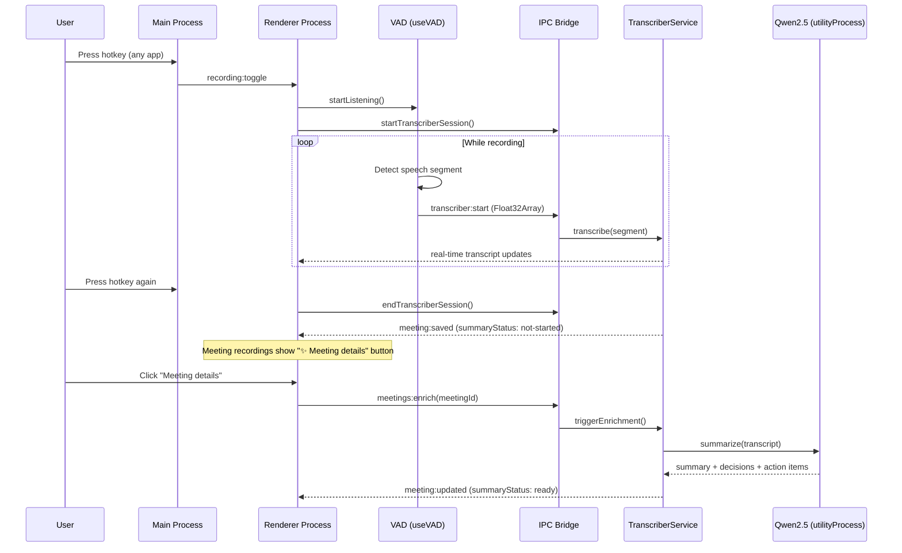

# VOA

| Meeting transcript                                                                   | Model selection                                           |
| ------------------------------------------------------------------------------------ | --------------------------------------------------------- |
|  |  |

**VOA** is a macOS desktop app that transcribes anything you say — meetings, calls, voice memos — using on-device AI. Press a hotkey from any app, speak, and get a searchable transcript with an AI-generated summary. Nothing leaves your machine.


---

## Why VOA

Most meeting recorders require a subscription, send your audio to the cloud, or drop a bot into your video call. VOA runs entirely on your Mac using [OpenAI Whisper](https://github.com/openai/whisper) via ONNX Runtime — no API keys, no account, no internet connection required during transcription. It works with any app: video calls, phone calls, in-person conversations, or your own voice memos.

In a world where ambient voice data is increasingly valuable — and increasingly at risk — VOA makes local AI transcription practical for everyday use.

---

## Features

- **Global hotkey capture** — start and stop recording from any app (configurable shortcut, default F1)
- **On-device Whisper transcription** — runs locally via `@xenova/transformers` + ONNX Runtime; no cloud
- **Voice Activity Detection** — automatically segments speech from silence using `@ricky0123/vad-web`
- **Smart meeting detection** — detects active calls in Zoom, Teams, Google Meet, and Slack via Accessibility API
- **AI summaries and action items** — structured meeting summaries generated locally with Qwen2.5-1.5B
- **Meetings and monologues** — distinguishes group calls from solo voice capture
- **macOS-native settings UI** — System Settings-style interface with 7 panes, light/dark/auto theme
- **Privacy-first** — all audio processing stays on your Mac; no telemetry, no account required

---

## AI Stack

VOA uses three on-device models — all downloaded once and cached locally:

| Purpose              | Model                                       | Notes                                          |
| -------------------- | ------------------------------------------- | ---------------------------------------------- |
| Speech-to-text       | OpenAI Whisper (via `@xenova/transformers`) | Runs in Node.js via ONNX Runtime               |
| Structured summaries | Qwen2.5-1.5B-Instruct                       | Local LLM for meeting summaries + action items |
| Summarization        | DistilBART CNN                              | Abstractive text summarization                 |

### Whisper model options

| Model  | Size    | Speed    | Accuracy |
| ------ | ------- | -------- | -------- |
| Tiny   | ~75 MB  | ⚡⚡⚡⚡ | ★★☆☆     |
| Base   | ~142 MB | ⚡⚡⚡   | ★★★☆     |
| Small  | ~466 MB | ⚡⚡     | ★★★★     |
| Medium | ~1.5 GB | ⚡       | ★★★★★    |

English-only variants available for each model (faster, smaller).

---

## How It Works



The main process registers a global shortcut and handles all AI inference. The renderer manages audio capture via Web Audio API + VAD, streaming raw `Float32Array` segments over IPC. Whisper runs in the Node.js main process via ONNX Runtime. Qwen2.5 runs in an Electron `utilityProcess` child to isolate ONNX crashes from the main process. Meeting summaries are generated on-demand when the user explicitly requests them — nothing runs automatically after recording ends.

---

## Getting Started

### Requirements

- macOS 13 (Ventura) or later
- Apple Silicon or Intel Mac
- ~500 MB disk space for the Tiny model (more for larger models)

### Download

> **Release builds coming soon.** Follow this repo and watch for the first GitHub Release.

### Build from source

```bash
git clone https://github.com/justanotherkevin/voa.git
cd voa
npm install
npm start
```

On first run, VOA downloads the selected Whisper model (~75 MB for Tiny). Subsequent launches use the cached model.

### Permissions

VOA requires three macOS permissions to function:

| Permission       | Why                                 |
| ---------------- | ----------------------------------- |
| Microphone       | Record your voice                   |
| Accessibility    | Detect when a meeting app is active |
| Screen Recording | Capture system audio from speakers  |

VOA's built-in permissions screen walks you through granting each one.

---

## Tech Stack

| Layer                    | Technology                                            |
| ------------------------ | ----------------------------------------------------- |
| Desktop shell            | Electron 35                                           |
| UI                       | React 19, TypeScript, Tailwind CSS v4, shadcn/ui      |
| AI inference             | `@xenova/transformers` (Whisper, DistilBART, Qwen2.5) |
| ONNX Runtime             | `onnxruntime-node` + `onnxruntime-web`                |
| Voice Activity Detection | `@ricky0123/vad-web`                                  |
| Persistent storage       | `electron-store`                                      |
| Build                    | `electron-vite`, `electron-builder`                   |
| Testing                  | Vitest, Playwright                                    |

---

## Contributing

Issues and pull requests are welcome. For major changes, open an issue first to discuss what you'd like to change.

---

## License

MIT — [Kevin Hu](https://github.com/justanotherkevin)
