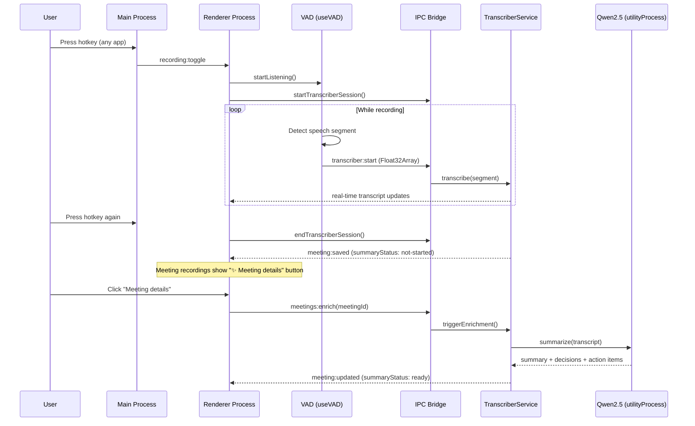

# VOA

| Meeting transcript                                                                   | Model selection                                           |
| ------------------------------------------------------------------------------------ | --------------------------------------------------------- |
|  |  |

**VOA** is a macOS desktop app that turns any meeting or call into structured notes — summary, key decisions, and action items — automatically, using on-device AI. Press a hotkey from any app, speak, and get a searchable transcript with an LLM-generated summary. No cloud, no API keys, nothing leaves your machine.


---

## Why VOA

Most meeting recorders give you a raw transcript and stop there, or they send your audio to a cloud LLM to extract action items. VOA runs two AI models on your Mac — [Whisper](https://github.com/openai/whisper) for speech-to-text, and [Qwen2.5-1.5B](https://huggingface.co/Qwen/Qwen2.5-1.5B-Instruct) for structured extraction — so every meeting ends with a summary, a decisions list, tagged topics, and concrete action items, all generated locally.

The on-device approach is also the privacy answer: no cloud subscription, no bot joining your call, no API keys, no audio ever leaving your machine. It works with any app — Zoom, Teams, Google Meet, phone calls, in-person conversations, or your own voice memos.

---

## Features

- **Global hotkey capture** — start and stop recording from any app (configurable shortcut, default F1)
- **On-device Whisper transcription** — runs locally via `@xenova/transformers` + ONNX Runtime; no cloud
- **Voice Activity Detection** — automatically segments speech from silence using `@ricky0123/vad-web`
- **Smart meeting detection** — detects active calls in Zoom, Teams, Google Meet, and Slack via Accessibility API
- **AI summaries and action items** — structured meeting summaries generated locally with Qwen2.5-1.5B
- **Meetings and monologues** — distinguishes group calls from solo voice capture
- **macOS-native settings UI** — System Settings-style interface with 7 panes, light/dark/auto theme
- **Privacy-first** — all audio processing stays on your Mac; no telemetry, no account required

---

## AI Stack

VOA uses three on-device models — all downloaded once and cached locally:

| Purpose              | Model                                       | Notes                                          |
| -------------------- | ------------------------------------------- | ---------------------------------------------- |
| Speech-to-text       | OpenAI Whisper (via `@xenova/transformers`) | Runs in Node.js via ONNX Runtime               |
| Structured summaries | Qwen2.5-1.5B-Instruct                       | Local LLM for meeting summaries + action items |
| Summarization        | DistilBART CNN                              | Abstractive text summarization                 |

### Whisper model options

| Model  | Size    | Speed    | Accuracy |
| ------ | ------- | -------- | -------- |
| Tiny   | ~75 MB  | ⚡⚡⚡⚡ | ★★☆☆     |
| Base   | ~142 MB | ⚡⚡⚡   | ★★★☆     |
| Small  | ~466 MB | ⚡⚡     | ★★★★     |
| Medium | ~1.5 GB | ⚡       | ★★★★★    |

English-only variants available for each model (faster, smaller).

---

## How It Works



The main process registers a global shortcut and handles all AI inference. The renderer manages audio capture via Web Audio API + VAD, streaming raw `Float32Array` segments over IPC. Whisper runs in the Node.js main process via ONNX Runtime. Qwen2.5 runs in an Electron `utilityProcess` child to isolate ONNX crashes from the main process. Meeting summaries are generated on-demand when the user explicitly requests them — nothing runs automatically after recording ends.

---

## Example Output

Given a recorded business call, here is what each stage of the pipeline produces.

**Stage 1 — Whisper transcript** (raw speech-to-text)

```
Glad to see things are going well and business is starting to pick up. Andrea told me about
your outstanding numbers on Tuesday. Keep up the good work. Now to other business, I am going
to suggest a payment schedule for the outstanding monies that is due. One, can you pay the
balance of the license agreement as soon as possible? Two, I suggest we setup or you suggest,
what you can pay on the back royalties, would you feel comfortable with paying every two weeks?
Every month, I will like to catch up and maintain current royalties. So, if we can start the
current royalties and maintain them every two weeks as all stores are required to do, I would
appreciate it. Let me know if this works for you.
```

**Stage 2 — text-cleaner**

Strips filler words and spoken disfluencies ("um", "uh", false starts) from the raw transcript. For clean speech the output is nearly identical; the cleaner mainly targets artifacts introduced by VAD segmentation.

**Stage 3 — Qwen2.5 structured summary** (generated on demand when you click "Meeting details")

```json
{
  "summary": "A business update call covering strong recent performance and a proposed payment
               schedule for outstanding license fees and back royalties, suggesting bi-weekly
               payments going forward.",
  "decisions": [
    "Establish bi-weekly royalty payment schedule",
    "Maintain current royalties on the same bi-weekly cadence required of all stores"
  ],
  "topics": ["payment schedule", "license agreement", "back royalties", "business performance"],
  "actionItems": [
    { "text": "Pay balance of the license agreement as soon as possible", "done": false },
    { "text": "Propose a payment amount for back royalties", "done": false },
    { "text": "Confirm bi-weekly payment schedule works", "done": false }
  ]
}
```

The summary, decisions, topics, and action items are rendered in the meeting detail view shown in the screenshot at the top of this README.

---

## Getting Started

### Requirements

- macOS 13 (Ventura) or later
- Apple Silicon or Intel Mac
- Node.js 18+
- ~500 MB disk space for the Tiny Whisper model (more for larger models)

### Quick start

```bash
git clone https://github.com/justanotherkevin/voa.git
cd voa
npm install
npm start
```

On first run, VOA downloads the selected Whisper model (~75 MB for Tiny). Subsequent launches use the cached model.

### Permissions

VOA requires three macOS permissions to function:

| Permission       | Why                                 |
| ---------------- | ----------------------------------- |
| Microphone       | Record your voice                   |
| Accessibility    | Detect when a meeting app is active |
| Screen Recording | Capture system audio from speakers  |

VOA's built-in permissions screen walks you through granting each one.

---

## Tech Stack

| Layer                    | Technology                                            |
| ------------------------ | ----------------------------------------------------- |
| Desktop shell            | Electron 35                                           |
| UI                       | React 19, TypeScript, Tailwind CSS v4, shadcn/ui      |
| AI inference             | `@xenova/transformers` (Whisper, DistilBART, Qwen2.5) |
| ONNX Runtime             | `onnxruntime-node` + `onnxruntime-web`                |
| Voice Activity Detection | `@ricky0123/vad-web`                                  |
| Persistent storage       | `electron-store`                                      |
| Build                    | `electron-vite`, `electron-builder`                   |
| Testing                  | Vitest, Playwright                                    |

---

## Root Cause Analysis (RCA)

Engineering decisions made to solve non-obvious problems discovered during development.

---

<details>
<summary><strong>RCA-1: VAD Model Hallucination on Long Audio</strong> — Whisper producing looping or fabricated text on long recordings</summary>

**Root cause:** The Silero VAD model (`@ricky0123/vad-web`) is small and lightweight — it is not designed to process arbitrarily long audio streams. Feeding it a full recording caused hallucination artifacts that propagated into the Whisper transcript.

**Solution:** Real-time audio segmentation. Instead of passing a full recording blob to Whisper, VAD fires an `onSpeechEnd` callback each time speech pauses. The hook accumulates `Float32Array` frames from each burst and flushes them as a combined segment after a 500ms silence window (`PAUSE_TIMEOUT_MS`). Whisper only ever sees short, clean speech segments grouped by natural pauses — never a raw long stream.

A second edge case: when the user stops recording mid-speech via hotkey, the 500ms timer would delay or drop the final segment. This is handled by setting a `forceSendOnNextSpeechEndRef` flag before calling `.pause()`. MicVAD's `submitUserSpeechOnPause: true` causes it to fire `onSpeechEnd` on pause; the flag tells the handler to flush immediately rather than start the timer.

**Key files:** `src/renderer/hooks/useVAD.ts`, `src/renderer/utils/VadConfig.ts`

</details>

<details>
<summary><strong>RCA-2: Qwen2.5 ONNX Crashes in Electron</strong> — SIGTRAP crashes killing the entire Electron main process</summary>

Three independent failure modes, each requiring its own fix:

**Process isolation:** Running a large ONNX model in the main process means any native crash from `onnxruntime-node` immediately terminates the app. Electron's `utilityProcess` API provides an isolated child process with its own heap and a `MessagePort`-based communication channel — a crash there cannot propagate up.

**Quantization:** `dtype: 'q4'` downloads `model_q4.onnx` (1.7 GB) and triggers `SIGTRAP` inside `onnxruntime-node`. Switching to `dtype: 'q8'` downloads `model_quantized.onnx` (~900 MB, INT8) which runs without crashing. Additionally, `package.json` pins the transitive `onnxruntime-node` dependency to `1.14.0` via `overrides` — without this pin, nested version drift reintroduced the crash.

**Model cache detection:** The `@huggingface/transformers` child process defaults to an internal cache path that `model-cache.ts` cannot discover. Explicitly setting `env.cacheDir` to `~/.cache/huggingface/hub` before loading the pipeline ensures the Settings UI can detect the downloaded model and show "Delete" instead of "Download."

**Key files:** `src/main/pipeline/structured-summarizer.ts`, `src/main/pipeline/structured-summarizer-process.ts`, `src/main/model-cache.ts`, `package.json`

</details>

---

## Contributing

Issues and pull requests are welcome. For major changes, open an issue first to discuss what you'd like to change.

---

## License

MIT — [Kevin Hu](https://github.com/justanotherkevin)
