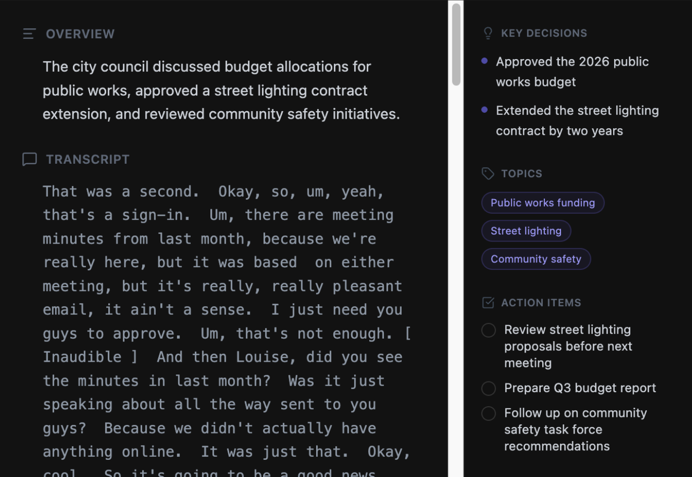
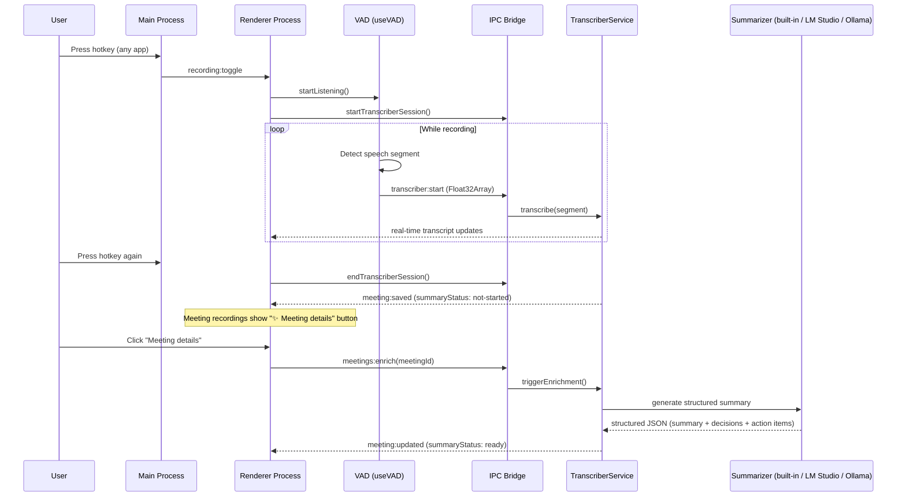

# VOA

| On boarding                                                                                                                           | Structured Data Preview                                     |
| ------------------------------------------------------------------------------------------------------------------------------------- | ----------------------------------------------------------- |
| <video src="https://github.com/user-attachments/assets/563177b7-e329-40ed-bd36-76ffc375a7b9" autoplay loop muted playsinline></video> |  |

**VOA** is a macOS desktop app that turns any meeting or call into structured notes — summary, key decisions, and action items — automatically, using local AI. Press a hotkey from any app, speak, and get a searchable transcript with an LLM-generated structured summary. Transcription runs fully on-device via Whisper; structured summaries run on a built-in, on-device LLM by default (LM Studio or Ollama also supported, if you'd rather bring your own model). No cloud, no API keys, your audio never leaves your machine.


---

## Why VOA

Most meeting recorders give you a raw transcript and stop there, or they send your audio to a cloud LLM to extract action items. VOA uses [Whisper](https://github.com/openai/whisper) for on-device speech-to-text and a bundled, on-device LLM (Qwen2.5-1.5B, GGUF) for structured extraction — no external server to install or run. Prefer to bring your own model instead? [LM Studio](https://lmstudio.ai) and [Ollama](https://ollama.com) are supported as alternatives. Every meeting ends with a summary, a decisions list, tagged topics, and concrete action items, generated entirely on your Mac.

The local approach is also the privacy answer: no cloud subscription, no bot joining your call, no API keys, no audio saved and ever leaving your machine. It works with any app — Zoom, Teams, Google Meet, phone calls, in-person conversations, or your own voice memos.

---

## Features

- **Global hotkey capture** — start and stop recording from any app (configurable shortcut, default `Cmd+Shift+Space`; see [Shortcuts](#shortcuts))
- **Dictation mode** — a separate hotkey (default `F2`) transcribes and pastes directly into the active window, skipping meeting detection entirely
- **On-device Whisper transcription** — runs locally via `@xenova/transformers` + ONNX Runtime; no cloud
- **Voice Activity Detection** — automatically segments speech from silence using `@ricky0123/vad-web`
- **Smart meeting detection** — detects active calls in Zoom, Teams, Google Meet, and Slack via Accessibility API
- **Built-in on-device AI summaries with rolling context** — for long meetings, the transcript is processed in chunks and the summary is updated incrementally; the bundled model runs locally with no setup, or bring your own via LM Studio or Ollama
- **Calendar-aware meeting matching** — link a private ICS feed and VOA automatically attaches matched calendar events (and attendees) to recordings
- **Meetings and dictations** — distinguishes group calls from solo voice capture, kept in separate sidebar sections
- **Guided first-run onboarding** — walks through permissions and downloads both AI models before you start recording
- **Privacy-first** — all audio processing stays on your Mac; no telemetry, no account required

---

## Shortcuts

Both shortcuts are global (work from any app) and configurable in Settings.

| Shortcut         | Default           | What it does                                          |
| ---------------- | ----------------- | ----------------------------------------------------- |
| Recording toggle | `Cmd+Shift+Space` | Starts/stops recording (meeting or dictation capture) |
| Dictation toggle | `F2`              | Starts/stops a dictation-to-paste session             |

---

## AI Stack

| Purpose              | Model / Tool                                          | Notes                                                           |
| -------------------- | ----------------------------------------------------- | --------------------------------------------------------------- |
| Speech-to-text       | OpenAI Whisper (via `@xenova/transformers`)           | Runs in Node.js via ONNX Runtime; downloaded and cached locally |
| Structured summaries | Qwen2.5-1.5B-Instruct GGUF (built-in) — default       | Runs on-device via `node-llama-cpp`; no external server needed  |
| Structured summaries | Any instruct model via LM Studio or Ollama — optional | Local OpenAI-compatible inference server; bring your own model  |

### Whisper model options

| Model  | Size    | Speed    | Accuracy | Status                                                |
| ------ | ------- | -------- | -------- | ----------------------------------------------------- |
| Tiny   | ~75 MB  | ⚡⚡⚡⚡ | ★★☆☆     | Available                                             |
| Base   | ~142 MB | ⚡⚡⚡   | ★★★☆     | Available (default, downloaded during onboarding)     |
| Small  | ~466 MB | ⚡⚡     | ★★★★     | Currently disabled — native crash under investigation |
| Medium | ~1.5 GB | ⚡       | ★★★★     | Currently disabled — native crash under investigation |

English-only variants available for each enabled model (faster, smaller).

---

## How It Works


```mermaid
sequenceDiagram
    participant User
    participant Main as Main Process
    participant Renderer as Renderer Process
    participant VAD as VAD (useVAD)
    participant IPC as IPC Bridge
    participant Transcriber as TranscriberService
    participant Summarizer as Summarizer (built-in / LM Studio / Ollama)

    User->>Main: Press hotkey (any app)
    Main->>Renderer: recording:toggle

    Renderer->>VAD: startListening()
    Renderer->>IPC: startTranscriberSession()

    loop While recording
        VAD->>VAD: Detect speech segment
        VAD->>IPC: transcriber:start (Float32Array)
        IPC->>Transcriber: transcribe(segment)
        Transcriber-->>Renderer: real-time transcript updates
    end

    User->>Main: Press hotkey again
    Renderer->>IPC: endTranscriberSession()
    Transcriber-->>Renderer: meeting:saved (summaryStatus: not-started)

    Note over Renderer: Meeting recordings show "✨ Meeting details" button
    User->>Renderer: Click "Meeting details"
    Renderer->>IPC: meetings:enrich(meetingId)
    IPC->>Transcriber: triggerEnrichment()
    Transcriber->>Summarizer: generate structured summary
    Summarizer-->>Transcriber: structured JSON (summary + decisions + action items)
    Transcriber-->>Renderer: meeting:updated (summaryStatus: ready)
```

The main process registers a global shortcut and handles all AI inference. The renderer manages audio capture via Web Audio API + VAD, streaming raw `Float32Array` segments over IPC. Whisper runs in a dedicated `utilityProcess` via ONNX Runtime. Structured summaries are generated on-demand, either by the bundled Qwen2.5-1.5B GGUF model running on-device via `node-llama-cpp` (the default), or by a `fetch()` call to an OpenAI-compatible endpoint (`/v1/chat/completions`) if you've switched to LM Studio or Ollama. Nothing runs automatically after recording ends. If a configured external inference server is unreachable when you click "Meeting details", VOA fails fast with a system notification and marks the meeting as failed — no silent errors, and you can retry at any time once a server is running. The transcript is always preserved.

---

## Example Output

Given a recorded business call, here is what each stage of the pipeline produces.

**Stage 1 — Whisper transcript** (raw speech-to-text)

```
Glad to see things are going well and business is starting to pick up. Andrea told me about
your outstanding numbers on Tuesday. Keep up the good work. Now to other business, I am going
to suggest a payment schedule for the outstanding monies that is due. One, can you pay the
balance of the license agreement as soon as possible? Two, I suggest we setup or you suggest,
what you can pay on the back royalties, would you feel comfortable with paying every two weeks?
Every month, I will like to catch up and maintain current royalties. So, if we can start the
current royalties and maintain them every two weeks as all stores are required to do, I would
appreciate it. Let me know if this works for you.
```

**Stage 2 — text-cleaner**

Strips filler words and spoken disfluencies ("um", "uh", false starts) from the raw transcript. For clean speech the output is nearly identical; the cleaner mainly targets artifacts introduced by VAD segmentation.

**Stage 3 — structured summary** (generated on demand when you click "Meeting details", by the built-in model or LM Studio/Ollama if configured)

```json
{
  "summary": "A business update call covering strong recent performance and a proposed payment
               schedule for outstanding license fees and back royalties, suggesting bi-weekly
               payments going forward.",
  "decisions": [
    "Establish bi-weekly royalty payment schedule",
    "Maintain current royalties on the same bi-weekly cadence required of all stores"
  ],
  "topics": ["payment schedule", "license agreement", "back royalties", "business performance"],
  "actionItems": [
    { "text": "Pay balance of the license agreement as soon as possible", "done": false },
    { "text": "Propose a payment amount for back royalties", "done": false },
    { "text": "Confirm bi-weekly payment schedule works", "done": false }
  ]
}
```

The summary, decisions, topics, and action items are rendered in the meeting detail view shown in the screenshot at the top of this README.

---

## Getting Started

### Requirements

- macOS 13 (Ventura) or later
- Apple Silicon or Intel Mac
- Node.js 18+
- ~1.3 GB disk space for the default first-run download (Whisper Base + the built-in Qwen2.5-1.5B GGUF summarizer)
- Optional: [LM Studio](https://lmstudio.ai) or [Ollama](https://ollama.com), if you'd rather use your own model for summaries instead of the built-in one

### Quick start

```bash
git clone https://github.com/justanotherkevin/voa.git
cd voa
npm install
npm start
```

On first run, VOA walks you through permissions, then downloads both the Whisper Base transcription model and the built-in summarization model before letting you record. Subsequent launches use the cached models.

### Permissions

VOA requires three macOS permissions to function:

| Permission       | Why                                 |
| ---------------- | ----------------------------------- |
| Microphone       | Record your voice                   |
| Accessibility    | Detect when a meeting app is active |
| Screen Recording | Capture system audio from speakers  |

VOA's built-in permissions screen walks you through granting each one.

---

## Tech Stack

| Layer                    | Technology                                                                                     |
| ------------------------ | ---------------------------------------------------------------------------------------------- |
| Desktop shell            | Electron 35                                                                                    |
| UI                       | React 19, TypeScript, Tailwind CSS v4, shadcn/ui                                               |
| AI inference (ASR)       | `@xenova/transformers` (Whisper)                                                               |
| ONNX Runtime             | `onnxruntime-node` + `onnxruntime-web`                                                         |
| AI inference (summaries) | `node-llama-cpp` (built-in Qwen2.5-1.5B GGUF), or LM Studio / Ollama (local OpenAI-compatible) |
| Voice Activity Detection | `@ricky0123/vad-web`                                                                           |
| Persistent storage       | `electron-store`                                                                               |
| Build                    | `electron-vite`, `electron-builder`                                                            |
| Testing                  | Vitest, Playwright                                                                             |

---

## Root Cause Analysis (RCA)

Engineering decisions made to solve non-obvious problems discovered during development.

---

<details>
<summary><strong>RCA-1: VAD Model Hallucination on Long Audio</strong> — Whisper producing looping or fabricated text on long recordings</summary>

**Root cause:** The Silero VAD model (`@ricky0123/vad-web`) is small and lightweight — it is not designed to process arbitrarily long audio streams. Feeding it a full recording caused hallucination artifacts that propagated into the Whisper transcript.

**Solution:** Real-time audio segmentation. Instead of passing a full recording blob to Whisper, VAD fires an `onSpeechEnd` callback each time speech pauses. The hook accumulates `Float32Array` frames from each burst and flushes them as a combined segment after a 500ms silence window (`PAUSE_TIMEOUT_MS`). Whisper only ever sees short, clean speech segments grouped by natural pauses — never a raw long stream.

A second edge case: when the user stops recording mid-speech via hotkey, the 500ms timer would delay or drop the final segment. This is handled by setting a `forceSendOnNextSpeechEndRef` flag before calling `.pause()`. MicVAD's `submitUserSpeechOnPause: true` causes it to fire `onSpeechEnd` on pause; the flag tells the handler to flush immediately rather than start the timer.

**Key files:** `src/renderer/hooks/useVAD.ts`, `src/renderer/utils/VadConfig.ts`

</details>

<details>
<summary><strong>RCA-2: Why the first on-device attempt (ONNX) for structured summaries was abandoned</strong> — Qwen2.5 ONNX crashes and JSON reliability drove a temporary migration to LM Studio; a later GGUF-based attempt succeeded and is now the default (see note below)</summary>

Three compounding problems made on-device ONNX inference for structured summaries untenable:

**SIGTRAP crashes:** Running Qwen2.5-1.5B via `onnxruntime-node` in the Electron main process caused `SIGTRAP` crashes that killed the entire app. Isolating it to an Electron `utilityProcess` helped contain crashes but added IPC complexity.

**Quantization fragility:** `dtype: 'q4'` (1.7 GB) triggered crashes; `dtype: 'q8'` (~900 MB) did not. `onnxruntime-node` had to be pinned to `1.14.0` via `package.json` overrides — any drift reintroduced the crash.

**JSON schema reliability:** Small models (1.5B–3B parameters) cannot reliably follow strict key-name contracts. The model consistently paraphrased field names (`"summarize"` instead of `"summary"`, `"action_items"` instead of `"actionItems"`) despite explicit one-shot examples. This is a known limitation at this parameter count; reliable structured output requires 7B+ models.

**Resolution (at the time):** Migrated structured summaries to LM Studio, an OpenAI-compatible local inference server that handles model management, hardware acceleration, and model selection. The app sent `POST /v1/chat/completions` to `http://localhost:1234` — no bundled model, no ONNX crashes, user picks any 7B+ model they already have. See `docs/lm-studio-migration.md` for the full analysis.

**Update:** A later attempt swapped the inference engine — `node-llama-cpp` running a GGUF build of Qwen2.5-1.5B-Instruct instead of ONNX — and hit 100% JSON-schema adherence with no crashes, at ~1.8s/call on Apple Silicon (Metal). This is now bundled as the default "Built-in" summarization provider; LM Studio and Ollama remain available as alternatives for anyone who prefers to bring their own model. See `docs/embedded-llm-migration.md` for the full writeup.

</details>

---

## Contributing

Issues and pull requests are welcome. For major changes, open an issue first to discuss what you'd like to change.

---

## License

MIT — [Kevin Hu](https://github.com/justanotherkevin)
