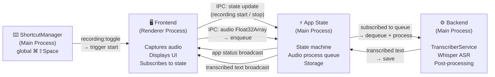
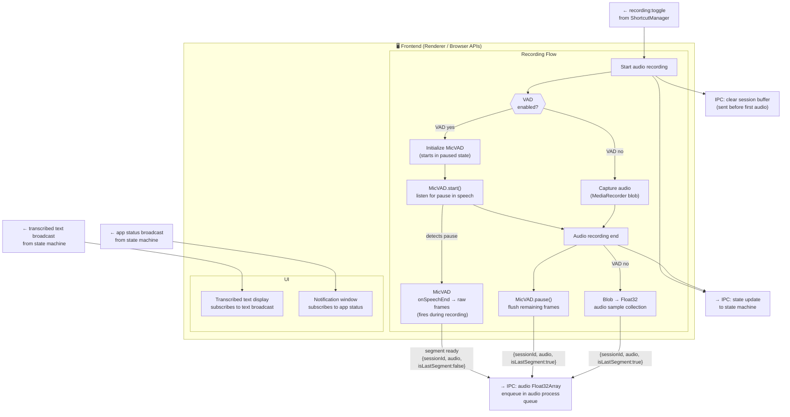
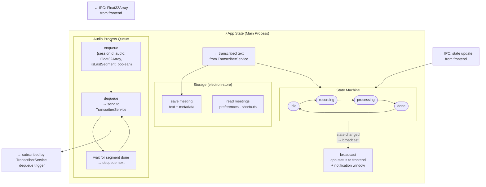
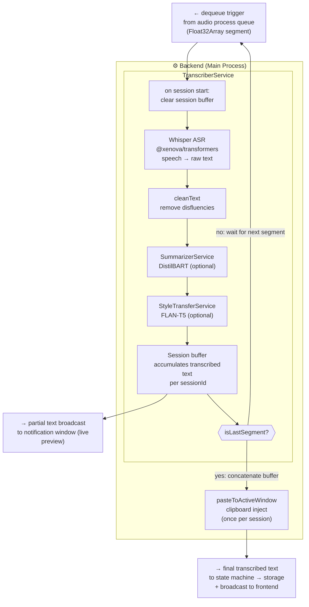
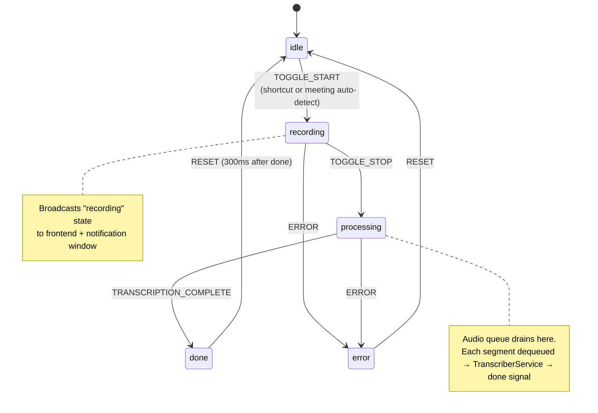

# App Architecture

Three layers: **Frontend** (audio capture + UI) | **App State** (state machine + queue + storage) | **Backend** (transcription pipeline).

---

## 1. System Overview

High-level three-column view. Start here.

---

## 2. Frontend Detail

What lives in the renderer process.

---

## 3. App State / State Machine Detail

The central coordinator. Frontend and backend both connect through here.

---

## 4. Backend Detail

Pure processing. No state ownership. Subscribes to the queue, returns text.

---

## 5. State Machine States

---

## 6. IPC Channel Map

| Channel                     | Direction       | Trigger                 | Purpose                                          |
| --------------------------- | --------------- | ----------------------- | ------------------------------------------------ |
| `recording:toggle`          | Main → Renderer | Global shortcut ⌘⇧Space | Tell frontend to start recording                 |
| `recording:event`           | Renderer → Main | User starts / stops     | Drive state machine (TOGGLE_START, TOGGLE_STOP)  |
| `recording:state-changed`   | Main → Renderer | Every state transition  | Frontend + notification window subscribe to this |
| `session:clear`             | Renderer → Main | Recording start         | Clear session buffer before first audio arrives  |
| `vad:frame`                 | Renderer → Main | MicVAD onSpeechEnd      | Raw Float32Array → enqueue {sessionId, audio, isLastSegment} |
| `transcriber:chunk`         | Main → Renderer | Whisper streaming       | Partial transcript for live display              |
| `transcriber:complete`      | Main → Renderer | Pipeline finished       | Final text + metadata                            |
| `meeting-detector:detected` | Main → Renderer | Active window poll      | Auto-start prompt                                |
| `meeting-detector:ended`    | Main → Renderer | Active window poll      | Auto-stop                                        |
| `meetings:get-all`          | Renderer → Main | Page load               | Read stored meetings                             |
| `meetings:saved`            | Main → Renderer | After save completes    | Push refresh to Meetings page                    |
