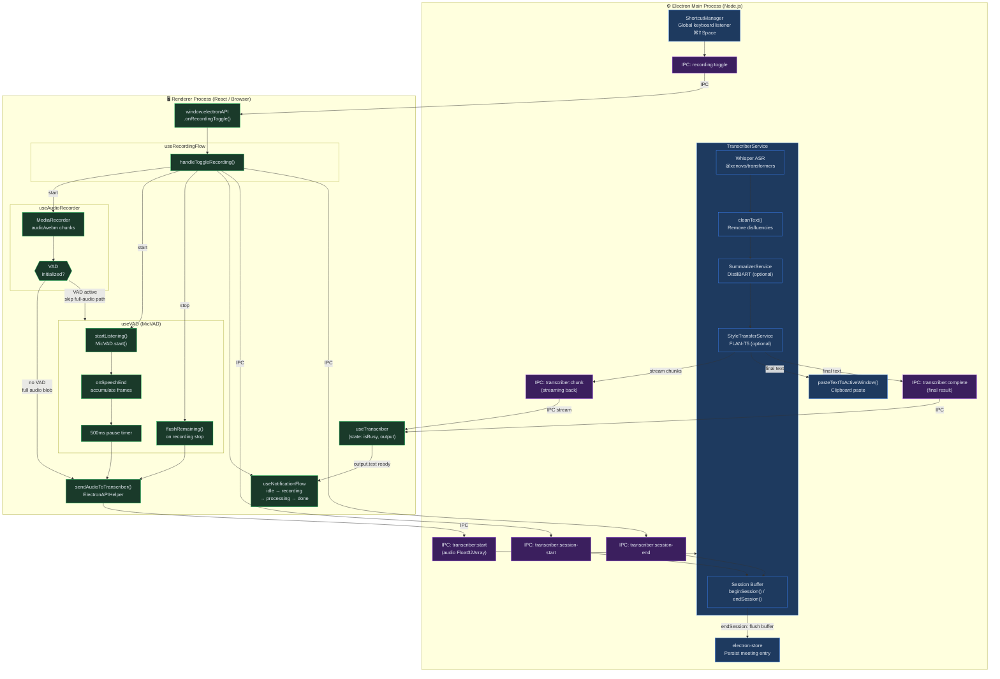

# Audio-to-Text Flow Diagram

End-to-end flow from user trigger to transcribed text output.



## Process Boundary

| Layer | Environment | Responsibilities |
|-------|-------------|-----------------|
| **Renderer** | Browser / React | Capture audio, VAD, UI state, notification transitions, shortcut event handling |
| **IPC Bridge** | `window.electronAPI` / `ipcMain` | Type-safe message passing; no direct Node.js or browser APIs cross the boundary |
| **Main Process** | Node.js / Electron | Whisper inference, post-processing, clipboard paste, persistent storage |

## Two Audio Paths

### Path A — VAD Mode (primary)
MicVAD segments speech in real-time → 500ms silence flushes a segment → sent immediately via IPC → Whisper transcribes → text pasted incrementally. Full MediaRecorder blob is **skipped** to avoid duplicate paste.

### Path B — Fallback (no VAD)
MediaRecorder records entire session → on stop, full blob sent via IPC → single Whisper pass → text pasted once.

## Session Lifecycle

```
startTranscriberSession(startedAt)   →  TranscriberService.beginSession()
  [VAD segments transcribed silently, buffered in sessionBuffer]
endTranscriberSession(endedAt)       →  TranscriberService.endSession()
  → joins buffer → post-processing → saveMeeting() → electron-store
```
