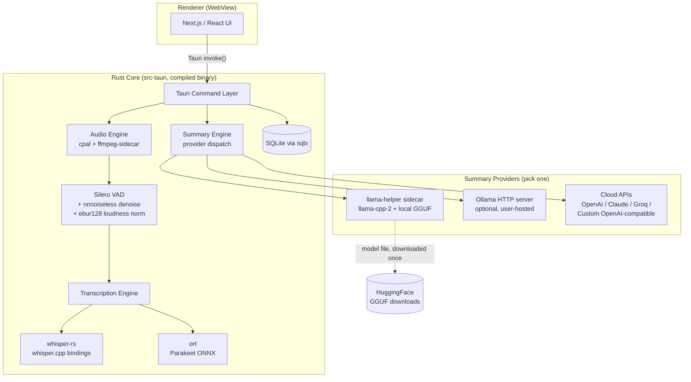
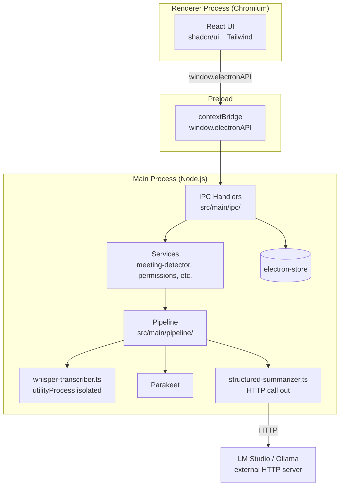

# Meetily Architecture Notes & Migration Considerations

Research notes from reading the [Meetily](https://github.com/Zackriya-Solutions/meetily) source
(`Zackriya-Solutions/meetily`, cloned at the commit current as of 2026-07-28). Meetily is a
privacy-first, open-source AI meeting assistant with the same core pitch as VOA: local recording →
local transcription → local summarization, no cloud required.

Two directories exist in that repo:

- **`backend/`** — a legacy Python FastAPI + Docker + whisper.cpp server. The repo's own
  `backend/README.md` says this "is no longer used... should not be used for new installs." Ignore it.
- **`frontend/`** (Tauri + Rust + Next.js) — the actual supported app. Everything below describes this one.

---

## 1. Meetily's Architecture

Meetily is a **Tauri v2** desktop app: a Rust core (`frontend/src-tauri/`) doing all the heavy
lifting, with a Next.js/React frontend for UI only. This is a fundamentally different process
model than VOA's Electron main/preload/renderer split — Tauri uses the OS's native webview instead
of bundling Chromium, and the "backend" is compiled Rust rather than a Node.js main process.

### Key architectural choices

- **No Node.js main process at all.** Audio capture, VAD, denoising, transcription, and
  summarization all run as native Rust code or Rust-spawned sidecar binaries, not JS.
- **Two transcription engines, chosen per platform/preference:** `whisper-rs` (Rust bindings to
  `whisper.cpp`, with Metal/CoreML/CUDA/Vulkan/HIP feature flags compiled in) and `ort`
  (ONNX Runtime, for Parakeet). This mirrors VOA's own Whisper/Parakeet dual-engine setup in
  `src/main/pipeline/asr-factory.ts`, just implemented in Rust instead of `onnxruntime-node`.
- **Summarization is a provider abstraction**, not a single fixed backend: `LLMProvider` enum =
  `BuiltInAI | Ollama | CustomOpenAI | OpenAI | Claude | Groq`. Onboarding always defaults to
  `BuiltInAI`, which is the one most relevant to your question:
  - **`BuiltInAI` runs entirely in-process via a Tauri _sidecar binary_ (`llama-helper`)** — a
    ~750-line Rust program linked against `llama-cpp-2` (Rust bindings for `llama.cpp`), talking to
    the main app over a line-delimited JSON protocol on stdin/stdout (`Generate`/`Ping`/`Shutdown`).
  - Model weights are **plain GGUF files pulled directly from HuggingFace** (e.g.
    `unsloth/Qwen3.5-2B-GGUF`), cached under `<app_data_dir>/models/summary/`. No Ollama, no
    LM Studio, no HTTP server involved for the default path.
  - The sidecar self-tunes GPU offload by reading available VRAM (`sysctl hw.memsize` on macOS,
    `nvidia-smi` elsewhere) and estimating layer count from GGUF file size — a heuristic, not exact
    model metadata.
  - **Ollama is only used if the user explicitly configures it** as an alternative provider
    pointing at their own running Ollama server — conceptually identical to VOA's current
    LM-Studio-over-HTTP approach (`docs/lm-studio-migration.md`), just one option among several
    rather than the only one.
- **SQLite via `sqlx`** for meeting/transcript storage — same idea as VOA's `electron-store`
  (`src/main/store/`), different underlying tech (real relational DB vs. JSON store).
- **Analytics**: `posthog-rs` is wired in directly — worth flagging since VOA has no telemetry
  today; not something to copy without a deliberate decision.

---

## 2. VOA's Current Architecture (for contrast)

The main differences that matter for a migration decision:

|                           | VOA (today)                                        | Meetily                                                                    |
| ------------------------- | -------------------------------------------------- | -------------------------------------------------------------------------- |
| Shell                     | Electron (Chromium bundled)                        | Tauri v2 (native OS webview)                                               |
| Core language             | TypeScript/Node.js                                 | Rust                                                                       |
| Whisper impl              | `onnxruntime-node` via `@huggingface/transformers` | `whisper-rs` → `whisper.cpp` (native, GPU feature flags)                   |
| Process isolation for ASR | Electron`utilityProcess`                           | In-process Rust (crash isolation would need its own sidecar)               |
| Summarization             | LM Studio/Ollama over HTTP only                    | Provider enum: embedded llama.cpp sidecar (default), Ollama, or cloud APIs |
| Storage                   | `electron-store` (JSON file)                       | SQLite (`sqlx`)                                                            |
| VAD/denoise               | `@ricky0123/vad-web`                               | Silero (Rust) +`nnnoiseless` RNNoise + `ebur128` loudness norm             |

---

## 3. Migration Steps: VOA → Meetily-style Architecture

This is a **framework migration** (Electron → Tauri), not a small refactor — flagging that up
front since it touches every file in `src/main/` and `src/renderer/`, and the payoff needs to
justify that cost before starting. Order matters: each phase should be independently shippable so
you're never mid-migration with a broken app.

1. **Decide scope first.** The two axes are independent — you can adopt "embedded local LLM
   instead of LM Studio/Ollama HTTP" _without_ touching Electron at all (see 3a below), or you can
   do the full Tauri rewrite. Confirm which one is actually the goal before committing to either.

   **3a. Embedded local-LLM path only (no Electron/Tauri change):**
   - Replace the LM Studio/Ollama HTTP cl ient in `structured-summarizer.ts` with a Node
     `child_process`/`utilityProcess`-spawned llama.cpp binary (e.g. via `node-llama-cpp`, which
     wraps `llama.cpp` with prebuilt bindings much like `llama-cpp-2` does for Rust) or a small
     sidecar binary you build yourself.
   - Bundle/download a GGUF model (Qwen 3.5 2B/4B are Meetily's current picks) instead of
     depending on an external LM Studio/Ollama process being installed and running.
   - This directly removes the "user must have LM Studio or Ollama installed and running" UX
     friction that `docs/lm-studio-migration.md` implies is currently required — likely the
     highest-value, lowest-risk piece of this whole comparison.
   - Verify against `docs/whisper-onnxruntime-crash.md`'s lesson: a child-process/sidecar model
     runner still needs real crash/queueing handling, not just isolation.

   **3b. Full Tauri migration (only if 3a isn't the point):**
   - New Tauri v2 shell project; port `src/renderer/` React components largely as-is (Tauri uses
     standard web frontends) — Tailwind/shadcn config, routing, and most components should port
     with minimal changes.
   - Rewrite `src/main/` piece by piece in Rust: start with the lowest-risk services (settings/store)
     before touching audio capture and ASR, which are the highest-risk, most-tested parts of VOA
     per the root `CLAUDE.md`'s emphasis on real-Electron verification.
   - Audio capture: `cpal` (cross-platform) + platform-specific system-audio capture replaces
     Electron's `desktopCapturer`/`electron-audio-loopback`.
   - ASR: `whisper-rs` (whisper.cpp bindings) replaces `onnxruntime-node`; `ort` crate replaces the
     JS ONNX Runtime for Parakeet. This is a full reimplementation of `whisper-transcriber.ts` and
     `asr-factory.ts`, not a port.
   - Storage: SQLite (`sqlx`) replaces `electron-store`; requires a schema + migration story where
     today's `runMigrations()` JSON-shape migrations don't directly translate.
   - Summarization: same as 3a, but as a Tauri sidecar (`tauri.conf.json` `externalBin`) instead of
     an Electron `utilityProcess`.
   - IPC: Tauri's `#[tauri::command]` + `invoke()` replaces `ipcMain`/`contextBridge`/`window.electronAPI`
     — a mechanical but repo-wide rename/restructure across every file in `src/main/ipc/`.
   - Testing: Playwright's Electron driver (`_electron`) doesn't apply to Tauri; Tauri has its own
     WebDriver-based e2e story, so `tests/e2e/` needs a parallel rewrite, not a port.
   - Packaging/updates: `electron-builder`/`electron-updater` replaced by Tauri's bundler + its own
     updater plugin (`tauri-plugin-updater`, visible in Meetily's `Cargo.toml`).

2. **Either way, the JSON-vs-key-naming problem you already solved is not solved by switching
   engines.** Meetily's `escape_user_prompt_control_markers` + strict per-model prompt templates
   (`QWEN35_NONTHINKING_TEMPLATE`) address prompt-injection-into-template issues, but they don't
   claim to have cracked reliable structured-JSON extraction from small models better than what
   `docs/lm-studio-migration.md` already documents you ran into. Don't expect the architecture
   change alone to fix output-quality problems — that's a model/prompting problem, orthogonal to
   Tauri vs. Electron.
3. **Given how young/architecture-heavy this is, this belongs in a proper brainstorm/plan before
   any code moves** — happy to help scope 3a vs. 3b in more detail once you've picked a direction.

---

## 4. Packages & Tools Used by Meetily

### Frontend (`frontend/package.json`)

| Package                                                                     | Purpose                                                                                         |
| --------------------------------------------------------------------------- | ----------------------------------------------------------------------------------------------- |
| `next` (v14)                                                                | React framework, static export for Tauri                                                        |
| `react` / `react-dom` (v18)                                                 | UI                                                                                              |
| `@tauri-apps/api`, `@tauri-apps/cli`                                        | Tauri JS bindings + CLI                                                                         |
| `@tauri-apps/plugin-{fs,notification,os,process,store,updater}`             | Tauri plugin bindings                                                                           |
| `@radix-ui/*`, `radix-ui`                                                   | Headless UI primitives (same family VOA uses)                                                   |
| `@blocknote/{core,react,shadcn}`                                            | Rich block-based text editor (meeting notes editing)                                            |
| `@remirror/*`, `@tiptap/*`                                                  | Two separate rich-text editor toolkits (both present — likely one is legacy/being migrated off) |
| `@tanstack/react-virtual`                                                   | List virtualization                                                                             |
| `@heroicons/react`, `lucide-react`                                          | Icon sets                                                                                       |
| `class-variance-authority`, `clsx`, `tailwind-merge`, `tailwindcss-animate` | Tailwind/shadcn styling utilities                                                               |
| `framer-motion`                                                             | Animation                                                                                       |
| `react-hook-form`, `@hookform/resolvers`, `zod`                             | Forms + schema validation                                                                       |
| `date-fns`                                                                  | Date formatting                                                                                 |
| `sonner`                                                                    | Toast notifications                                                                             |
| `cmdk`                                                                      | Command palette                                                                                 |
| `react-markdown`, `remark-gfm`                                              | Markdown rendering                                                                              |

### Rust Core (`frontend/src-tauri/Cargo.toml`)

| Crate                                                                                            | Purpose                                                                                                |
| ------------------------------------------------------------------------------------------------ | ------------------------------------------------------------------------------------------------------ |
| `tauri` (v2) + `tauri-plugin-{fs,dialog,store,notification,updater,process,single-instance,log}` | App shell, window management, plugins                                                                  |
| `whisper-rs`                                                                                     | Rust bindings to`whisper.cpp`; feature flags for `metal`/`coreml`/`cuda`/`vulkan`/`hipblas`/`openblas` |
| `ort`                                                                                            | ONNX Runtime bindings, used for Parakeet models                                                        |
| `silero_rs` (git dep)                                                                            | Silero VAD                                                                                             |
| `nnnoiseless`                                                                                    | RNNoise-based neural noise suppression                                                                 |
| `ebur128`                                                                                        | EBU R128 loudness normalization                                                                        |
| `cpal` (patched fork)                                                                            | Cross-platform audio I/O                                                                               |
| `ffmpeg-sidecar` (git dep)                                                                       | Bundled ffmpeg for audio format handling                                                               |
| `symphonia`                                                                                      | Pure-Rust audio decoding (aac/mp3/flac/ogg/wav/etc.)                                                   |
| `rubato`, `realfft`, `ringbuf`                                                                   | Audio resampling / FFT / ring buffers                                                                  |
| `sqlx` (sqlite, tokio runtime)                                                                   | Async SQLite database access                                                                           |
| `tokio`, `tokio-util`, `async-trait`, `futures-util`                                             | Async runtime                                                                                          |
| `reqwest`                                                                                        | HTTP client (cloud LLM providers, model downloads)                                                     |
| `serde`, `serde_json`                                                                            | Serialization                                                                                          |
| `crossbeam`, `dashmap`                                                                           | Concurrency primitives / concurrent hashmap                                                            |
| `sysinfo`                                                                                        | System resource monitoring                                                                             |
| `posthog-rs`                                                                                     | Product analytics                                                                                      |
| `chrono`, `uuid`, `dirs`, `regex`, `thiserror`, `anyhow`, `log`/`env_logger`/`tracing`           | Standard utility/error-handling/logging crates                                                         |
| `esaxx-rs` (patched fork)                                                                        | Suffix-array string search, likely tokenizer-adjacent                                                  |
| `whatlang`                                                                                       | Language detection                                                                                     |
| `tempfile`, `rand`, `rayon`, `bytemuck`, `bytes`                                                 | Misc utilities                                                                                         |

### `llama-helper` sidecar (separate crate, `llama-helper/Cargo.toml`)

| Crate                                     | Purpose                                                             |
| ----------------------------------------- | ------------------------------------------------------------------- |
| `llama-cpp-2` (pinned `=0.1.146`)         | Rust bindings to`llama.cpp` — the actual local-LLM inference engine |
| `anyhow`, `serde`/`serde_json`            | Error handling, JSON stdin/stdout protocol                          |
| `encoding_rs`                             | UTF-8 decoding of streamed token output                             |
| Feature flags:`metal` / `cuda` / `vulkan` | GPU backend selection, same pattern as`whisper-rs`                  |

### External model sources (not packages, but load-bearing)

- **HuggingFace** — GGUF weights downloaded directly (`unsloth/Qwen3.5-{2B,4B}-GGUF`,
  `bartowski/google_gemma-3-{1b,4b}-it-GGUF`), no Ollama/LM Studio model registry involved.
- **Ollama** — optional, only if the user points the app at their own running server.
